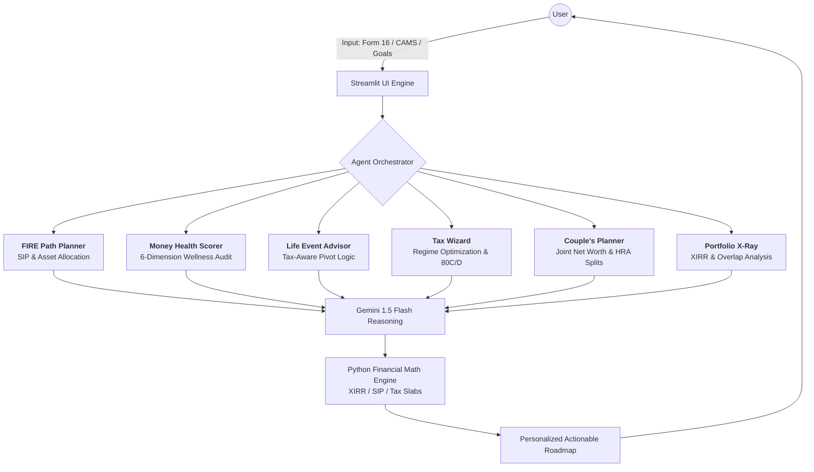

# 💰 AI Money Mentor
### *Autonomous Financial Orchestration for 1.4 Billion Indians*

**AI Money Mentor** is an agentic financial ecosystem designed to bridge the "Advice Gap." While professional financial planning in India is often inaccessible due to high costs, our platform leverages **Gemini 1.5 Flash** to provide institutional-grade tax optimization, retirement modeling, and portfolio diagnostics—instantly and autonomously.

---

## 🏗️ Technical Architecture: The Agentic Core

The system operates on a **Request-Router-Specialist** pattern. A central **Orchestrator** parses user intent and delegates data to six specialized sub-agents.

🚀 Core Features & Agent Roles
1. Money Health Score
A 5-minute diagnostic onboarding flow that generates a comprehensive financial wellness score across 6 critical dimensions:

Emergency Preparedness: Liquid fund adequacy vs. monthly burn.

Insurance Coverage: Gap analysis in Term and Health cover.

Investment Diversification: Asset allocation health.

Debt Health: Debt-to-income ratio optimization.

Tax Efficiency: Leakage detection in current filings.

Retirement Readiness: Projected corpus vs. lifestyle inflation.

2. Tax Wizard (Regime Optimizer)
Upload a Form 16 or input a salary structure. The agent identifies every missed deduction (80C, 80D, HRA, NPS), models the Old vs. New Tax Regime with precision, and suggests tax-saving investments ranked by risk profile and liquidity needs.

3. FIRE Path Planner
User inputs age, income, expenses, and life goals. The AI builds a complete, month-by-month financial roadmap including:

Systematic Investment Plan (SIP) amounts tailored to specific goals.

Asset Allocation Shifts: Automated "Glide Paths" moving from Equity to Debt as retirement nears.

4. Couple’s Money Planner
India's first AI-powered joint planning tool. Both partners input data, and the AI optimizes across both incomes for:

HRA Claims & NPS Matching: Strategic splitting for maximum tax efficiency.

Joint vs. Individual Insurance: Cost-benefit analysis of combined policies.

Combined Net Worth Tracking: A unified view of household wealth.

5. Mutual Fund (MF) Portfolio X-Ray
Upload CAMS or KFintech statements for a sub-10 second deep dive:

True XIRR: Accurate internal rate of return calculations.

Overlap Analysis: Detecting redundant fund holdings to reduce risk.

Rebalancing Plan: AI-generated shifts to return to the target risk profile.

6. Life Event Financial Advisor
Handles specific, high-stakes decisions triggered by life events—bonus, inheritance, marriage, or a new baby. The advisor provides customized pivots based on the user's current tax bracket and portfolio.

🛠️ Technical Stack & Setup
LLM: Google Gemini 1.5 Flash (Reasoning & Orchestration)

Frontend: Streamlit (Reactive Web Interface)

Math Engine: Python (NumPy/Pandas for precise financial modeling)

Installation
Clone: git clone https://github.com/tejasvish2426-gif/AI-Money-Mentor.git

Install: pip install -r requirements.txt

Run: streamlit run app.py

📊 Business & Social Impact
Wealth Recovery: Identifies an average of ₹15,000 in "leaked" tax savings per user annually.

Cost Democratization: Reduces a 2-week human planning process costing ₹25,000 to a 5-minute AI-driven session for near-zero cost.

